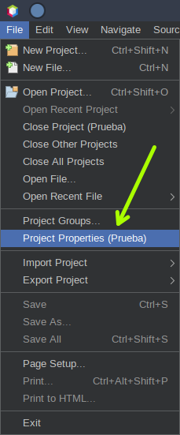

# JDK

La versión para desarrollar durante el curso es [**_Java SE 21 & JDK 21_**](https://docs.oracle.com/en/java/javase/21/docs/api/index.html) (_Standard Edition & Java Development Kit version 21)_, la cual es [LTS](<https://en.wikipedia.org/wiki/Java_version_history#Java_SE_21_(LTS)>) (_Long-Term Support_).

Se recomienda utilizar la implementación de [OpenJDK](https://jdk.java.net/java-se-ri/21) o de [Oracle](https://www.oracle.com/java/technologies/downloads/#java21), aunque cualquier otra debería funcionar de manera similar.

Ahora bien, en caso que se tenga más de un **JDK** instalado, es necesario configurar el proyecto para que utilice la versión correspondiente (**21**).

En esta guía se muestran los pasos para hacerlo con tres IDEs:

- [Eclipse](#eclipse)
- [IntelliJ IDEA](#intellij-idea)
- [Netbeans](#netbeans)

 

## Eclipse

Este IDE se puede descargar desde la [página oficial](https://eclipseide.org).

Cuando se va a crear un proyecto nuevo, se debe escoger la versión correspondiente (**21**):

 

## IntelliJ IDEA

La versión **Community Edition**, la cual es _Open Source_, se puede descargar desde su [página oficial](https://www.jetbrains.com/idea/download/).

Cuando se va a crear un proyecto nuevo, se debe escoger la versión correspondiente:

Ahora bien, si el proyecto ya fue creado, se puede configurar accediendo a su estructura (_Project Structure_) desde el menú (_File_):

Una vez ahí, se debe seleccionar las configuraciones del proyecto (_Project_):

Y escoger la versión correspondiente del **JDK**/**SDK** (**21**):

Para finalmente, aceptar los cambios (_OK_):

 

## Netbeans

Este IDE se puede descargar desde su [página oficial](https://netbeans.apache.org/front/main/index.html).

Primero, luego de crear un proyecto, se debe ir a sus propiedades (_Properties_). Esto se logra haciendo clic derecho sobre el nombre del proyecto (en el ejemplo se llama `Prueba`), o bien, desde la opción del menú:

Segundo, se debe acceder a las opciones de compilación (_Compile_) en la parte de construcción (_Build_):

Tercero, se debe escoger la versión correspondiente (**21**) tanto para la plataforma (_Java Platform_) como su objetivo (_Target Release_):

Cuarto, aceptar los cambios (_OK_):

