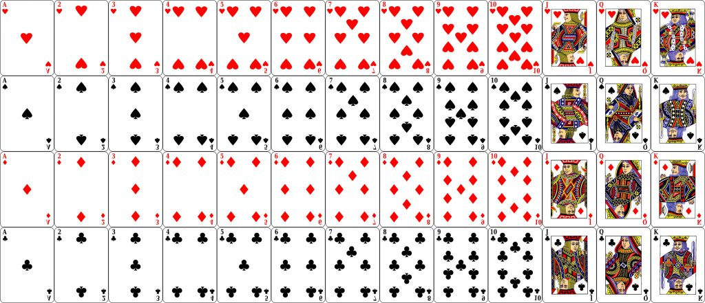
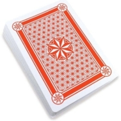
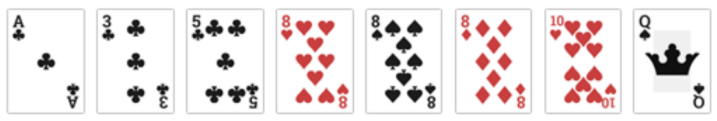

# Proyecto Final

| Curso    | Estructuras de Datos    |
| :------- | :---------------------- |
| Código   | SC-304                  |
| Periodo  | III Cuatrimestre 2025   |
| Profesor | Luis Andrés Rojas Matey |
| Valor    | 50 %                    |

 

- [Introducción](#introducción)
- [Objetivo](#objetivo)
- [Especificaciones funcionales](#especificaciones-funcionales)
  - [Crear una partida nueva](#crear-una-partida-nueva)
  - [Cargar una partida existente](#cargar-una-partida-existente)
- [Especificaciones técnicas](#especificaciones-técnicas)
- [Entregables](#entregables)
- [Evaluación](#evaluación)

 

## Introducción

El juego de naipes [**_The Sandwich Guy_**](https://boardgamegeek.com/boardgame/360987/the-sandwich-guy) es para divertirse en solitario, utilizando una baraja común, usualmente denominada como ["inglesa"](https://es.wikipedia.org/wiki/Baraja_inglesa). Consiste en hacer sándwiches con tripletas de cartas para irlas descartando.

 

## Objetivo

Aplicar los conocimientos adquiridos para desarrollar una aplicación de escritorio del juego **_The Sandwich Guy_**.

 

## Especificaciones funcionales

Al ejecutar la aplicación, se le deben proveer dos opciones al usuario:

1. Crear una partida nueva.

2. Cargar una partida existente.

 

### Crear una partida nueva

Cuando se crea una partida nueva, se presenta en pantalla una baraja ordenada, simulando que están en su **Caja**, la cual contiene cincuenta y dos cartas, divididas en cuatro palos de trece cartas cada palo.

Estos son los cuatro palos, con sus nombres y colores:

- `♥`: **Corazones** de color rojo.
- `♦`: **Diamantes** de color rojo.
- `♠`: **Picas** de color negro.
- `♣`: **Tréboles** de color negro.

Las trece cartas de cada palo, con sus respectivos valores y nombres serían:

1. `A`: As
2. `2`: Dos
3. `3`: Tres
4. `4`: Cuatro
5. `5`: Cinco
6. `6`: Seis
7. `7`: Siete
8. `8`: Ocho
9. `9`: Nueve
10. `10`: Diez
11. `J`: Jota
12. `Q`: Quina
13. `K`: Ka

Posteriormente, y luego que el usuario indique que se "barajen" las cartas (por ejemplo, con un botón), se creará una pila de cartas de forma aleatoria boca abajo, la cual se llamará **Mazo**:

De ese **Mazo**, se sacarán automáticamente ocho cartas y se pondrán boca arriba, una al lado de la otra en línea, en un sitio que se denominará **Mano**. Por ejemplo:

Debe existir otra sección llamada **Pozo**, en la cual se dispondrán las cartas que se descarten, pero boca abajo.

Importante tener en cuenta que en todo momento debe ser posible ver las cartas de cada sitio (**Caja**, **Mazo**, **Mano** y **Pozo**), mostrando sus características según la estructura de datos utilizada.

En cada turno, el usuario puede escoger tres de las ocho cartas de la **Mano**, las cuales deben ordenarse de tal forma que hagan un "sándwich válido" y, esto es, si una de las tres cartas está exactamente entre las otras dos, es decir, que la diferencia entre la primera y la segunda carta sea igual que la diferencia entre la segunda y tercera carta, teniendo en cuenta que puede haber una "vuelta", o sea, cuando se pasa de la carta `K` a la `A`.

Siguiendo con el ejemplo de la anterior **Mano**, el usuario podrá entonces escoger alguna de estas tripletas, ya que forman sándwiches válidos:

- `[A|♣]` `[3|♣]` `[5|♣]`: diferencia de 2 (`|1 - 3| = |3 - 5| ⇒ 2 = 2`).
- `[8|♠]` `[Q|♠]` `[3|♣]`: diferencia de 4 (con `Q,K,A,2,3` dando la vuelta).
- `[8|♥]` `[8|♠]` `[8|♦]`: diferencia de 0.

Sin embargo, esta otra tripleta no forma un sándwich válido: `[8|♥]` `[10|♥]` `[8|♣]` (ya que `|8 - 10| ≠ |10 - 11| ⇒ 2 ≠ 1`).

Cuando la tripleta forma un sándwich válido, las tres cartas se pueden descartar en el **Pozo**, teniendo en cuenta lo siguiente:

- Si las tres cartas pertenecen al mismo palo (por ejemplo `[A|♣]` `[3|♣]` `[5|♣]`), entonces se pueden tomar hasta cuatro cartas más del **Mazo** para incorporarlas a la **Mano**.

- Si las tres cartas tienen el mismo color (como `[8|♠]` `[Q|♠]` `[3|♣]`), se pueden tomar hasta tres cartas del **Mazo** para llevarlas a la **Mano**.

- Si las tres cartas no son del mismo color (ejemplo, `[8|♥]` `[8|♠]` `[8|♦]`), se pueden tomar hasta dos cartas del **Mazo** para ponerlas en la **Mano**.

En cualquier caso, se puede tener un máximo de ocho cartas en la **Mano**.

Ahora bien, cuando un usuario escoge las tres cartas de la **Mano** para hacer un posible sándwich, el programa debe indicar las seis permutaciones de dicha tripleta, así como la cantidad de posibles cartas a tomar del **Mazo** para cada combinación, con lo que el usuario puede indicar si desea "enviar" la tripleta al **Pozo** y, de ser un sándwich válido, automáticamente se cargarán a la **Mano** la cantidad mayor de cartas correspondiente a dicha tripleta. Sin embargo, note que el usuario puede deseleccionar una, dos o las tres cartas que forman la tripleta y, posteriormente, elegir otras cartas para conocer sus permutaciones.

La partida termina cuando se da alguna de estas dos situaciones:

- Se gana la partida si el **Mazo** queda vacío.

- Se pierde la partida si no se puede hacer un sándwich válido con las cartas de la **Mano**.

En cualquiera de ambos casos, se le debe indicar al usuario el resultado (partida ganada o perdida) y ya no se puede seguir jugando dicha partida.

Cada vez que se tomen cartas del **Mazo** para llevarlas a la **Mano**, se debe verificar automáticamente si quedan cartas disponibles. De no haber disponibles (el **Mazo** quedó vacío), se gana la partida.

Además, durante la partida debe haber estas opciones:

- **Ordenar**. Permite ordenar las cartas de la **Mano** según sus valores, ascendentemente de izquierda a derecha.

- **Validar**. Verifica si en la **Mano** existe algún sándwich válido. Si no hay, se pierde la partida.

- **Guardar**. Permite guardar el estado de la partida (las cartas de la **Caja**, el **Mazo**, la **Mano** y el **Pozo**), incluso si ya ha finalizado. Para esto, se le debe solicitar al usuario el nombre y ubicación de un archivo [XML](https://developer.mozilla.org/es/docs/Web/XML/Guides/XML_introduction), en el cual se guardará la información.

 

### Cargar una partida existente

Esta opción permite cargar una partida previamente guardada, es decir, cargar uno de los archivos XML que fueron guardados.

Para esto, se le debe solicitar al usuario que escoja un archivo y el programa lo cargará, tal como la partida fue guardada. Si la partida no ha finalizado (no se ha ganado o perdido), entonces se puede seguir jugando como una partida usual; por el contrario, si la partida está finalizada, se debe indicar si se ganó o perdió.

 

## Especificaciones técnicas

La versión para desarrollar el proyecto debe ser [**_Java SE 21 & JDK 21_**](https://docs.oracle.com/en/java/javase/21/docs/api/index.html) (_Standard Edition & Java Development Kit version 21)_, la cual es [LTS](https://en.wikipedia.org/wiki/Java_version_history#Java_SE_21_(LTS)) (_Long-Term Support_). Se recomienda utilizar la implementación de [OpenJDK](https://jdk.java.net/java-se-ri/21) o de [Oracle](https://www.oracle.com/java/technologies/downloads/#java21).

Al ser una aplicación de escritorio ([_Desktop_](https://docs.oracle.com/en/java/javase/21/docs/api/java.desktop/module-summary.html)) con interfaz gráfica, se debe utilizar alguna _Library_ de **_Java_** para este fin, como lo son [AWT](https://docs.oracle.com/en/java/javase/21/docs/api/java.desktop/java/awt/package-summary.html) y/o [Swing](https://docs.oracle.com/en/java/javase/21/docs/api/java.desktop/javax/swing/package-summary.html). Se puede utilizar cualquier otra, tal como [JavaFX](https://openjfx.io), mientras sea de código abierto (_Open Source_) o de libre acceso.

Para la manipulación de los archivos XML, se debe utilizar el _Module_ estándar de **_Java_** para tal fin: [java.xml](https://docs.oracle.com/en/java/javase/21/docs/api/java.xml/module-summary.html).

Con respecto a los componentes del proyecto (objetos, clases, estructuras, etc.), estos deben ser:

- **Carta**: objeto (clase) propia que permite determinar el valor, número/letra, nombre y palo de una carta.

- **Caja**: lista doble de cartas.

- **Mazo**: pila de cartas.

- **Mano**: lista circular de cartas.

- **Pozo**: cola de cartas.

Para las combinaciones de la tripleta escogida de la **Mano** del posible sándwich, se debe utilizar una estructura de búsqueda (como por ejemplo un árbol binario), donde cada nodo contenga la tripleta de cartas y la cantidad de cartas a tomar del **Mazo**. Por ejemplo, dadas tres cartas cualesquiera `x`, `y` y `z`, estas son sus seis posibles permutaciones:

- `[x]` `[y]` `[z]`
- `[x]` `[z]` `[y]`
- `[y]` `[z]` `[x]`
- `[y]` `[x]` `[z]`
- `[z]` `[x]` `[y]`
- `[z]` `[y]` `[x]`

Y cada combinación puede tener alguno de estos valores (según la cantidad de cartas a tomar del **Mazo**):

- **4** (sándwich válido con el mismo palo)
- **3** (sándwich válido con palos del mismo color)
- **2** (sándwich válido con palos de distinto color)
- **0** (no es un sándwich válido)

Así mismo, para determinar si una **Mano** tiene al menos un sándwich válido (es decir, la opción de **Validar**), se debe usar algún algoritmo que permita evaluar todas sus posibles tripletas.

Adicionalmente, todos los componentes pueden ser objetos propios (clases propias), o bien, se pueden utilizar las clases estándar disponibles en **_Java_**, excepto la clase **Carta** (la cual, como se indicó, debe ser de autoría propia).

Finalmente, las cartas deben instanciarse una sola vez durante cada partida. Esto implica que se crean una única vez al inicio de una partida (cuando están en la **Caja**), para luego "moverlas" (por manejo de referencias) a las otras estructuras (**Mazo**, **Mano** y **Pozo**) o referenciarlas en otras (las tripletas a evaluar), según corresponda.

 

## Entregables

Debido a que este proyecto se debe hacer según los grupos establecidos, el único entregable (es decir, lo único que se debe subir al **Campus Virtual**) es el vínculo (_link_) al repositorio en línea de [Git](https://git-scm.com) (como por ejemplo, a [GitHub](https://github.com) o [GitLab](https://about.gitlab.com)). Este vínculo debe ser subido por <ins>solo uno de los miembros del grupo</ins>. Este repositorio puede ser privado, pero <ins>deberá ser público</ins> al momento de los avances, así como cuando les toque el turno de la exposición del proyecto en la semana correspondiente, para que el profesor pueda tener acceso al mismo.

En el repositorio debe estar lo siguiente:

- Todo el código fuente del proyecto, excepto los archivos compilados, es decir, excluir los archivos `.class`.

- Un archivo `README.md` escrito en [Markdown](https://www.markdownguide.org) en la raíz del proyecto, que contenga lo siguiente:

  - Los nombres y carnés de los integrantes del grupo. <ins>Estos serán los únicos que serán tomados en cuenta para la calificación</ins>.

  - El nombre de usuario y correo de **Git** de cada integrante.

  - Los editores o IDEs (_Integrated Development Environment_) utilizados.

  - Todas las referencias de sitios webs con explicaciones, ejemplos y _snippets_ de código utilizados, así como los _prompts_ (tanto de entrada como de salida) de los agentes de AI que se hayan utilizado.

  - Un breve instructivo que incluya:
    - <ins>Instalación</ins>. Por ejemplo, _Libraries_ de terceros que se tengan que instalar/utilizar.
    - <ins>Compilación o creación</ins>. Como por ejemplo, algún parámetro que deba recibir el compilador de **_Java_** (`javac ...`).
    - <ins>Ejecución</ins>. Como los argumentos recibidos por la máquina virtual de **_Java_** para que el programa ejecute (`java ...`).

 

## Evaluación

El proyecto será calificado según la rúbrica que se presenta en el programa del curso.
